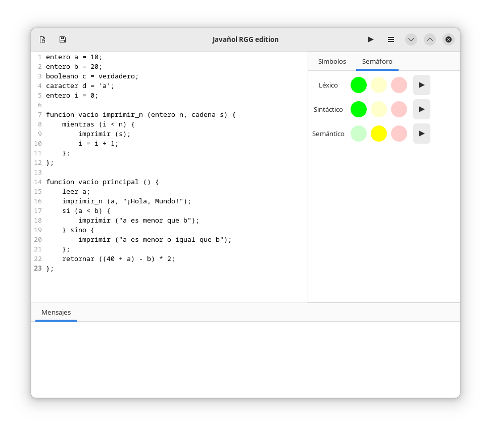

# Javañol RGG edition

Javañol es un lenguaje de programación que, a pesar de llamarse como
aquel lenguaje maldecido por sus usuarios, no se parece nada a él (al
igual que ese otro lenguaje). Lo que sí es cierto, es que está en
español, para que la comunidad hispanohablante le entienda.

En su fase actual, es solo un prototipo no funcional; pero quizás
algún día llegue a convertirse en un lenguaje real tampoco muy
funcional. Eso depende del tiempo que sus autores dediquen en él; no
les recomiendo poner su confianza en que suceda.



Este proyecto se realizó para la materia de Lenguajes y Autómatas 2,
con el profesor I.S.C. Ricardo González González (RGG). Somos
estudiantes de Ingeniería en Sistemas Computacionales, en el
[Tecnológico Nacional de México en Celaya](https://celaya.tecnm.mx/).

Un agradecimiento especial a [Drew DeVault](https://drewdevault.com/),
quien creó el lenguaje de programación [Hare](https://harelang.org),
de cuyo [compilador](https://git.sr.ht/~sircmpwn/hare) tomamos un
montón de código. Pero, hey, le añadimos algunas sorpresas.

## Instalación

Para que funcione esta cosa, se necesitan las siguientes librerías:

| Librería                                              | Autor            | Licencia    |
|-------------------------------------------------------|------------------|-------------|
| [python-gobject](https://pypi.org/project/PyGObject/) | James Henstridge | GNU LGPLv2+ |
| [graphviz](https://pypi.org/project/graphviz/)        | Sebastian Bank   | MIT         |

Se requiere tener instalado [GTK4](https://gtk.org/), porque es lo que
usamos para la interfaz gráfica, y te deseo suerte corriéndolo en
Windows o macOS, la verdad no lo he probado, porque no uso ninguno de
los dos. También se necesita [Graphviz](https://graphviz.org/), porque
es con lo que se renderiza el árbol de sintaxis en PDF (¡sorpresa!)

## Ejecución

Para correr la interfaz gráfica, basta con posicionarte en el
directorio raíz del proyecto, y ejecutar el siguiente script (solo
para GNU/Linux):

```bash
bash run_gui.sh
```

Si no tienes GNU/Linux, puedes hacer lo siguiente:

```bash
cd interfaz/
python main.py
```

## Licencia

```
Copyright (C) 2022  